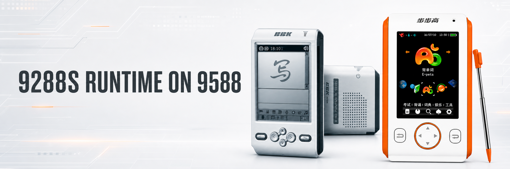
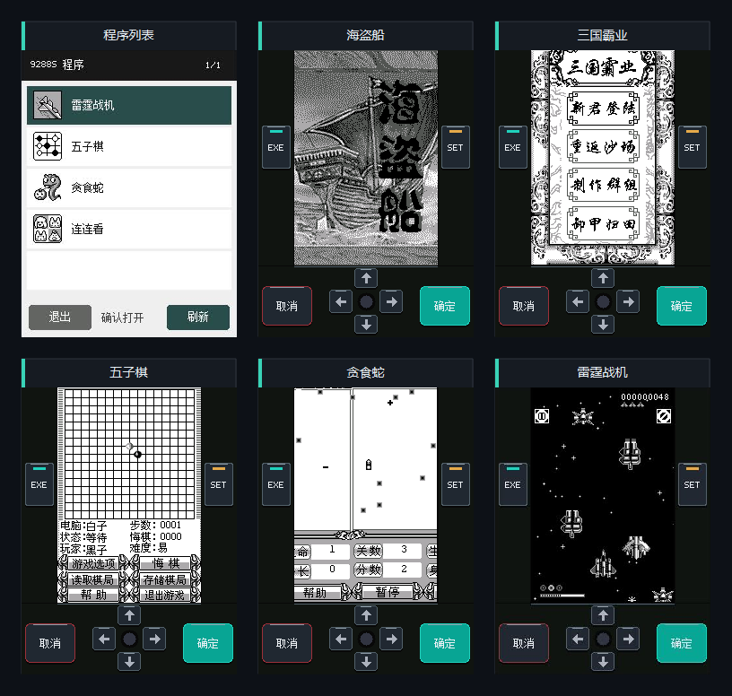

<p align="center">
  
</p>

<h1 align="center">bbk9288s-runtime-for9588</h1>

<p align="center">
  在 BBK 9588 上直接加载并运行 9288S D300 EXE
</p>

<p align="center">
  <a href="#快速开始">快速开始</a> ·
  <a href="#截图预览">截图预览</a> ·
  <a href="#功能介绍">功能介绍</a> ·
  <a href="docs/API_IMPLEMENTATION.md">API 实现清单</a>
</p>

## 简介

本项目是面向 BBK 9588 的 9288S 应用兼容运行时。它在一个原生 9588 BDA
中实现 D300 装载器、S1C33 执行核心和 9288S 系统 API 兼容层，从而运行未经
修改的 9288S EXE。

运行时启动后会扫描指定程序目录，直接读取每个 D300 EXE 自带的标题和图标，
生成程序列表；选中程序后再动态加载并执行。它不是完整的 9288S 硬件模拟器，
也不会把游戏数据预先打包进 BDA。

> 项目仍在持续完善兼容 API。已覆盖的程序路径不代表所有 9288S 软件都能
> 完整运行，真机兼容性应以实际测试和日志为准。

项目依赖的
[9588 原生 BDA SDK](https://github.com/HelloClyde/bbk9588-bda-sdk)
以 Git 子模块形式固定在 `sdk/`。

## 快速开始

### 1. 准备运行时

有正式版本时可从
[GitHub Releases](https://github.com/HelloClyde/bbk9288s-runtime-for9588/releases)
下载 `9288S.bda`；尚无 Release 或需要最新开发版时，请按照后面的源码构建
步骤自行生成。使用设备现有的 BDA 安装方式把它安装到 9588；BDA 内部标题为
`9288S`。

### 2. 放入 9288S 程序

在 9588 上建立以下目录：

```text
A:\应用\数据\9288s\系统\程序\
```

把你有权使用的 9288S D300 EXE 直接复制到该目录。例如：

```text
A:\应用\数据\9288s\系统\程序\
├─ 海盗船.exe
├─ 三国霸业.exe
├─ 五子棋.exe
└─ 贪食蛇.exe
```

### 3. 启动

打开 `9288S`。程序扫描期间会显示 Loading 状态，完成后即可在自绘列表中
看到 EXE 自带的标题和图标。选择一个程序后，运行时会直接装载原始 D300
映像，无需文件选择对话框。

### 从源码构建

环境要求：

- Windows PowerShell；
- Python 3.10 或更高版本；
- Git；
- 一个或多个你有权使用的 9288S D300 EXE。

```powershell
git clone --recurse-submodules `
  https://github.com/HelloClyde/bbk9288s-runtime-for9588.git
cd bbk9288s-runtime-for9588
.\scripts\build-bda.ps1
```

生成文件位于：

```text
build\bbk9588\9288S.bda
```

第一次构建会通过 SDK 下载带固定校验值的 MIPS 工具链，并存放在 Git 忽略的
`sdk/.toolchain/` 目录。已有仓库如果尚未初始化 SDK，只需执行：

```powershell
git submodule update --init sdk
```

## 截图预览



上图展示程序列表以及《海盗船》《三国霸业》《五子棋》《贪食蛇》和
《雷霆战机》的已覆盖画面路径。截图用于展示当前界面和渲染效果，其中包含
模拟器回归画面；真机运行结果需单独验证。

## 功能介绍

### D300 程序管理

- 扫描 `应用/数据/9288s/系统/程序` 中的 EXE；
- 解析 D300 容器、程序映像、标题和两态图标；
- 扫描期间显示 Loading、已扫描数量和有效程序数量；
- 运行结束后可返回列表并切换到其他程序。

### S1C33 执行核心

- 模拟 9288S 应用地址空间和 GNU S1C33 ABI；
- 解释执行未经修改的原始程序映像；
- 在 9588 上提供 MIPS32 基本块 JIT；
- 使用 PC 哈希、失败负缓存和解释器回退处理尚未覆盖的指令；
- 支持算术、内存访问、条件分支及延迟槽等常用热路径。

### 图形输出

- 承接 9288S DC 状态、2bpp 图像和常用绘图原语；
- 支持源矩形裁剪、透明色、局部刷新和双缓冲相关路径；
- 160×240 客体画面以竖屏方式显示在 240×320 的 9588 屏幕中；
- 普通界面保留程序画面和运行时操作区；
- 全屏模式按比例双线性缩放到约 213×320，避免横向拉伸；
- 按 PS for 9588 的校验方式直接写 RGB565 framebuffer，固件布局不匹配时
  自动回退到原生 `RenderPicture`。

### 输入与系统界面

- 读取 9588 原始触摸事件并转换为 9288S 指针消息；
- 读取 9588 原始按键包并转换为 9288S 键盘消息；
- 活跃运行循环不依赖 Frame 窗口输入事件；
- 原程序的帮助说明由 9588 原生 Help Page 承接；
- 退出确认等系统交互由 9588 原生对话框承接。

### 定时器与消息循环

- 实现 9288S 风格的消息队列和可恢复客体回调；
- 按 `(hwnd, id)` 管理 `SetTimer` 与 `KillTimer`；
- 使用 9588 单调时钟推进客体计时器；
- 控制执行节奏，避免程序因宿主循环过快而加速运行。

### 文件与存档

- 把 `A:\应用\数据\9288s` 作为 9288S 客体看到的完整根目录；
- 不按游戏名称写死文件路径或存档文件名；
- 保留原程序使用的相对目录和绝对目录层级；
- 写文件时自动建立缺失的中间目录；
- 阻止通过 `..` 越过兼容运行时根目录；
- 支持客体自绘的存档、读档界面和持久化文件。

## 当前兼容情况

目前重点回归以下程序和路径：

| 程序 | 已覆盖的主要路径 |
| --- | --- |
| 海盗船 | 标题、棋盘、连续移动、帮助页、五槽存档与读档 |
| 三国霸业 | 标题、主菜单、势力图、战略地图、移动、功能菜单与存档 |
| 五子棋 | 游戏选项、棋盘、落子、触摸和方向输入 |
| 贪食蛇 | 菜单、开始游戏、连续移动和计时 |
| 连连看 | 菜单、棋盘、触摸选择和倒计时 |
| 雷霆战机 | 标题、开始游戏、连续移动和动态画面 |

声音 API 尚未实现。不同来源或不同版本的 EXE 可能使用额外系统 API，遇到
未覆盖调用时需要继续补充兼容层。详细状态见
[9288S 系统 API 实现清单](docs/API_IMPLEMENTATION.md)。

## 工作原理

```text
9288S D300 EXE
        │
        ▼
D300 解析、重定位与地址空间
        │
        ▼
S1C33 解释器 ── MIPS32 基本块 JIT
        │
        ▼
9288S 重定位表 API 陷阱
        │
        ▼
9588 图形 / 输入 / 定时器 / 文件 / Help Page
        │
        ▼
RGB565 framebuffer 与 9588 原生系统服务
```

9288S 应用通过重定位表调用系统 API 时，兼容层会拦截调用并转换为 9588
服务。运行时不模拟 NAND、LCDC、ADC、GPIO 或完整的 9288S 内核。

这些应用使用的 GNU S1C33 ABI 以 `R6` 至 `R9` 传递前四个参数，并以 `R4`
返回标量值。间接调用重定位表函数时，`R4` 通常先保存目标地址，再由函数
返回值覆盖。

## 程序目录与存档

`A:\应用\数据\9288s` 是统一的客体根目录。常见映射如下：

| 9288S 程序访问的路径 | 9588 实际路径 |
| --- | --- |
| `A:\` | `A:\应用\数据\9288s\` |
| `A:\系统\程序\海盗船.exe` | `A:\应用\数据\9288s\系统\程序\海盗船.exe` |
| `A:\SAVE0.DAT` | `A:\应用\数据\9288s\SAVE0.DAT` |
| `A:\系统\数据\游戏存档.sav` | `A:\应用\数据\9288s\系统\数据\游戏存档.sav` |
| `相对目录\文件.dat` | `A:\应用\数据\9288s\相对目录\文件.dat` |

删除或覆盖 `应用/数据/9288s` 前请先备份；该目录除了 EXE，还可能保存全部
游戏进度和配置。

## 日志与问题定位

真机日志位于：

```text
A:\应用\数据\9288s\9288LOG.TXT
```

日志包含程序扫描、D300 装载、API 调用异常、JIT 心跳和退出统计。v12 起还会记录
9288S 片内 VRAM 首次激活及扩展后的客体内存布局；Frame 与输入架构从 v11 起复用
同一个日志句柄，并过滤逐项扫描、逐帧按键和触摸等高频记录，以降低日志对
启动和运行速度的影响。

排查真机问题时，建议复现后保留现场十几秒，再退出或重启设备；不要再次打开
运行时，直接复制完整日志。显示相关问题可关注：

- `VIDEO_DIRECT_READY`：已启用直接 framebuffer 输出；
- `VIDEO_DIRECT_REJECTED`：固件布局校验失败，已使用安全回退；
- `SELECTOR_SCAN_END`：`v1` 为扫描耗时，单位是 25 ms；
- `GUEST_STANDBY`：9288S 程序请求切换待机策略；
- `GUEST_IVRAM_ACTIVE`、`GUEST_IVRAM_STATS`：程序已直接写入 9288S
  片内 VRAM，以及退出时的写入/提交/非零字节统计；
- `GUEST_IO_READY`：已映射 9288S 内部外设页及 S1C33L05 时钟寄存器；
- `AUDIO_SOURCE_OPEN`：已解析雷霆战机等程序的 RIFF/WAVE 或原始 PCM
  `MIXERSOURCE`；
- `AUDIO_MIXER_COMPAT`：程序进入了当前静音承接的旧 Mixer 生命周期；
- `DISPATCH_FAIL` 与 `VM_STOP` 的 `fpc/op/addr`：窗口回调内真正失败的
  S1C33 指令地址、opcode 和访存地址（v13 起），不会再被外层
  `DispatchMessage` 陷阱地址遮住；
- `JIT_HEARTBEAT`、`JIT_STATS_*`：JIT 命中、回退、校验及连续块分发统计；
- `SCHED_STATS`（v17 起）：时间片到期、客体真正空闲、实际 framebuffer
  提交和因画面未变化而跳过提交的次数。

## 开发与测试

运行 Python 和宿主 C 运行时测试：

```powershell
.\scripts\test-host.ps1
```

检查本地 D300 文件：

```powershell
python .\tools\d300_inspect.py .\local\pirate_ship.exe --strings
```

探测可移植核心执行 D300 映像的进度：

```powershell
.\scripts\probe-d300.ps1 -Image .\local\pirate_ship.exe
```

对 LavaXOS 体验版中的五个 `.lav` 分别执行长按键回归：

```powershell
.\scripts\probe-lava-matrix.ps1 `
  -Image "D:\path\to\系统\程序\LavaXOS.exe"
```

仓库结构：

```text
assets/                README 图片和 BDA 图标
docs/                  架构、API 清单及兼容说明
runtime/include/       可移植 D300/C33 运行时接口
runtime/src/           可移植运行时实现
ports/bbk9588/         9588 BDA 宿主适配层
scripts/               构建、测试和开发辅助脚本
tests/                 Python 与宿主运行时测试
tools/                 D300 分析及安装辅助工具
sdk/                   固定版本的 9588 SDK 子模块
local/                 本地 EXE，Git 忽略
build/                 构建产物，Git 忽略
```

## Tag 自动发布

`.github/workflows/release.yml` 会在推送 Tag 时：

1. 运行 Python 测试和宿主 C 运行时测试；
2. 检出固定版本的 `sdk` 子模块；
3. 在 Windows 环境构建并校验 `9288S.bda`；
4. 生成 `SHA256SUMS.txt`；
5. 上传工作流产物并创建或更新同名 GitHub Release。

```powershell
git tag v0.1.0
git push origin v0.1.0
```

也可以在 GitHub Actions 页面手动运行。手动运行只生成工作流产物，不创建
Release。

## 相关文档

- [架构说明](docs/architecture.md)
- [9288S 系统 API 实现清单](docs/API_IMPLEMENTATION.md)
- [海盗船兼容记录](docs/pirate-ship.md)
- [数据与版权说明](DATA_NOTICE.md)
- [9588 原生 BDA SDK](https://github.com/HelloClyde/bbk9588-bda-sdk)
- [GBA for 9588](https://github.com/HelloClyde/gba-for9588)
- [PSX for 9588](https://github.com/HelloClyde/psx-for9588)

## 数据与版权

本仓库不包含 BBK 固件、9288S 原始 EXE、游戏资源或存档。请只使用你有权
持有和运行的数据。程序兼容性研究与运行时源代码不授予任何第三方软件的
分发权。
